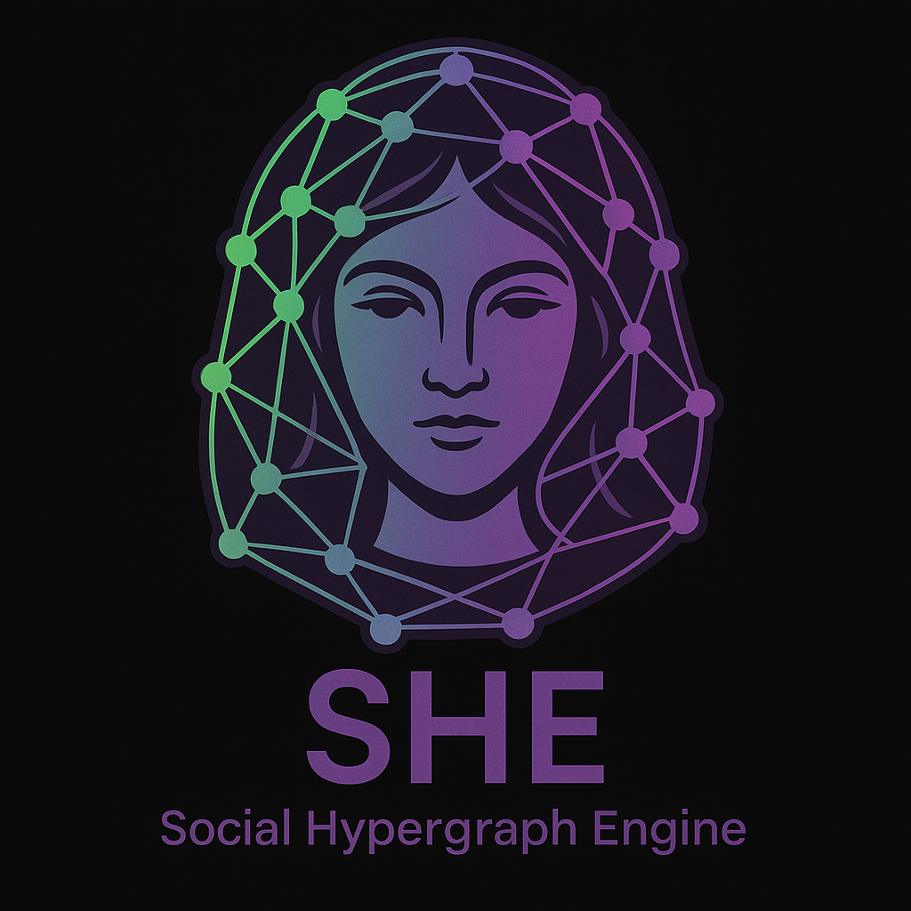

[](/LICENSE.txt)

<p align="center">
  
</p>

# SHE: Simplicial Hyperstructure Engine

**SHE** is a modular platform for ingesting data and modeling it as weighted, attributed simplicial sets, enabling analysis and prediction with Simplicial Neural Networks (SNNs), persistent homology, finite Morse theory, and algebraic invariants.

---

## 🔺 Motivation

Graphs are not enough. Many systems involve **higher-order relationships**: teams, cliques, co-occurrences, pathways, triadic influence.  
SHE offers a full computational framework to model and analyze these structures using tools from **topological data analysis**, **algebraic geometry**, and **neural learning**.

---

## 📦 Features

- Ingest raw data and build **time-evolving simplicial complexes**
- Add **weights** and **attributes** to nodes, edges, and higher-order simplices
- Apply **Simplicial Neural Networks (SNNs)** via [TopoX](https://github.com/simplicial-topology/topox)
- Compute **persistence diagrams**, Laplacians, and other topological invariants
- Simulate and evaluate **diffusion dynamics**
- Visualize evolution and structure with an interactive **Streamlit dashboard**

---

## 📁 Project Structure

```
SHE/
├── data/                    # Raw or preprocessed data
├── src/
│   ├── ingestion.py         # Build simplicial sets from structured data
│   ├── model.py             # Train SNNs using TopoX
│   ├── evolution.py         # Compute persistent homology, Morse features
│   ├── simulator.py         # Simulate diffusion processes
│   ├── evaluator.py         # Measure diffusion quality
│   └── dashboard.py         # Streamlit visualization UI
├── notebooks/
│   └── simulation_demo.ipynb
├── requirements.txt
└── README.md
```

---

## 🚀 Quickstart

Install dependencies:

```bash
pip install -r requirements.txt
```

Run the dashboard:

```bash
streamlit run src/dashboard.py
```

Run the simulation demo notebook for a full example.

---

## 🧠 Designed for Extensibility

SHE supports integration with:
- **SIA (Social Intelligence Augmentation)** — prediction, role inference, behavioral modeling
- **Giotto-TDA**, **XGI**, **PyTorch**, and symbolic tools
- Any data type requiring higher-order modeling (biology, finance, linguistics, neuroscience)

---

## License
This project is licensed under the **Holomathics Non-Commercial License (HNCL)**.  
You are free to use, modify, and share this software for **personal, research, or educational** purposes.  
**Commercial use requires a separate license** from Holomathics.  
📧 Contact: [info@holomathics.com](mailto:info@holomathics.com)

---

## ✒️ Authors

**Mirco A. Mannucci**, with contributions from collaborators.
