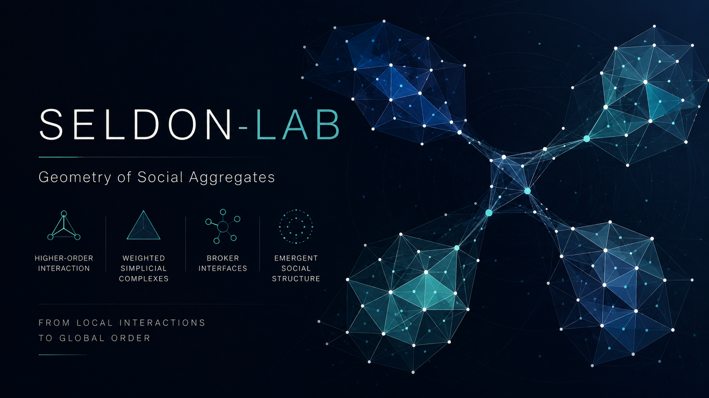

# seldon-lab

<p align="center">
  
</p>


`seldon-lab` is the scientific layer on top of the broader S.H.E. ecosystem.
Its current canonical deliverable is the geometry-first DBLP pilot and the
accompanying paper in [`paper/`](paper/). Secondary aggregation-birth and
reinforcement material remains in `reports/archive/`.

## Scope

This repository covers three distinct workstreams at different stages of
completion:

**paper1 — static geometry** (`DONE`)
Static higher-order geometry of scientific collaboration networks, using DBLP
data for SDM and WSDM.  All analyses support
`paper/the_geometry_of_social_interaction.tex`.  Outputs are curated under
`artifacts/paper1/`.  The primary observables are simplex weights, curvature
balance, reinforcement, and brokerage-edge signatures.

**Law-candidate work — dynamic event prediction** (`ONGOING, not yet in a paper`)
Aggregation birth, reinforcement, and decay as predictable transformation
events.  Law candidates are assembled in `src/seldon_lab/laws/` and evaluated
via `she_geofield.dblp.temporal_flow`.  This workstream produces threshold-
style models and Spearman-correlation baselines but has not yet reached the
paper-submission stage.

**bridge_to_cluster / fission / fusion — event detection machinery** (`PLANNED`)
Detection and classification of structural transition events: bridge-to-cluster
promotions, fission of aggregations, and fusion of distinct units.  Partial
machinery lives in `she-geofield` (metrics, candidate extraction); stubs and
ontology hooks exist in `seldon-lab` but are not yet experimentally validated.
This workstream is planned for a future paper.

## Dependency model

This repo is designed to live next to the sibling `she-geofield` repo:

```text
SHE/
  she-geofield/
  seldon-lab/
```

`seldon-lab` bootstraps that sibling path automatically for local development,
but a fresh clone still needs `she-geofield` present for the DBLP geometry and
event experiments. Tests that require `she_geofield` skip cleanly if it is not
available.

## Quick start

```bash
git clone <your-sheldon-remote> seldon-lab
git clone <your-she-geofield-remote> ../she-geofield

cd seldon-lab
python -m venv .venv
source .venv/bin/activate
pip install -e .[dev]

# Optional, but explicit and portable.
export PYTHONPATH=src:../she-geofield/src

pytest -q
python -m seldon_lab.experiments.dblp_geometry \
  --config configs/dblp_sdm_geometry.yaml
```

Generated outputs land in `out/` locally. The repo only commits the curated
paper-facing subset under [`artifacts/paper1/`](artifacts/paper1/).

Dependency structure:

- `SHE` remains the substrate for higher-order structures
- `she-geofield` remains the mechanism toolbox for geometry-field experiments
- `seldon-lab` owns aggregation ontology, identity tracking, transformation
  events, and law-candidate workflows

Current focus:

1. define what counts as a collaboration aggregation
2. represent aggregation state over time
3. match aggregations across windows
4. detect birth, reinforcement, decay, and bridge-to-cluster events
5. summarize cross-venue structural signatures

This repository is not an influence-ranking package. It is a laboratory for the
birth, stabilization, transformation, and decay of collaboration aggregations.

## Geometry-first pilot

The first paper-level static geometry pilot runs from `seldon-lab`, not from
`she-geofield`.

Single-venue geometry runs:

```bash
PYTHONPATH=src:../she-geofield/src python -m seldon_lab.experiments.dblp_geometry \
  --config configs/dblp_sdm_geometry.yaml

PYTHONPATH=src:../she-geofield/src python -m seldon_lab.experiments.dblp_geometry \
  --config configs/dblp_wsdm_geometry.yaml
```

Cross-venue summary:

```bash
PYTHONPATH=src:../she-geofield/src python -m seldon_lab.experiments.dblp_geometry_summary \
  --config configs/dblp_sdm_geometry.yaml \
  --config configs/dblp_wsdm_geometry.yaml \
  --output-dir out/dblp_geometry_cross_venue
```

These commands generate the local `out/` trees from which the curated paper
artifacts in `artifacts/paper1/` were selected. The paper source itself is
`paper/the_geometry_of_social_interaction.tex`.

Geometry robustness and validation bundle:

```bash
PYTHONPATH=src:../she-geofield/src python -m seldon_lab.experiments.dblp_geometry_validation \
  --config configs/dblp_sdm_geometry.yaml \
  --config configs/dblp_sdm_geometry_exact.yaml \
  --config configs/dblp_sdm_geometry_decay.yaml \
  --config configs/dblp_wsdm_geometry.yaml \
  --config configs/dblp_wsdm_geometry_exact.yaml \
  --config configs/dblp_wsdm_geometry_decay.yaml \
  --output-dir out/dblp_geometry_validation
```

This validation bundle emits:

- `weight_sensitivity.csv` and `weight_sensitivity_plot.png`
- `baseline_correlations.csv`
- `baseline_vs_ricbal_plot.png`
- `brokerage_validation.csv` and `brokerage_validation_plot.png`

## Layout

- `paper/`: paper source and compiled PDF
- `artifacts/paper1/`: curated figures and tables cited by the geometry-first paper
- `src/seldon_lab/ontology/`: aggregation objects, state, event records, matching
- `src/seldon_lab/trajectories/`: temporal tracks and track summaries
- `src/seldon_lab/summaries/`: cross-event tables and case-study exports
- `src/seldon_lab/datasets/`: dataset-specific loaders and slices
- `src/seldon_lab/features/`: interpretable aggregation features
- `src/seldon_lab/events/`: event definitions
- `src/seldon_lab/laws/`: law-candidate summaries and threshold-style models
- `src/seldon_lab/experiments/`: config-driven experiment entry points
- `src/seldon_lab/viz/`: trajectory and case-study plotting
- `reports/archive/`: secondary archived law-candidate and event material

## First flagship tasks

The first serious empirical tasks are:

- the geometry-first DBLP pilot that supports `paper/the_geometry_of_social_interaction.tex`
- aggregation birth as the first transformation-level law candidate

The guiding question is:

> Which local candidate regions become bona fide higher-order aggregations, and
> which fail to stabilize?

DBLP is used here as the first clean laboratory, not as the final target
domain.

## Current DBLP lab status

The static geometry pilot now runs directly from `seldon-lab`. The older
event-transformation workflow still depends on lower-level `she-geofield`
machinery, but the paper-facing geometry layer and outputs are now owned here.

Canonical committed paper artifacts are under:

- `artifacts/paper1/`
- `paper/`

Local generated outputs are written to `out/` but are not versioned. Earlier
event-oriented outputs still live under `she-geofield/out/` and remain
historical scaffolding for the broader Seldon program. Archived birth and
reinforcement notes remain under `reports/archive/`.

That keeps the architecture clean:

- `she-geofield` remains the lower-level DBLP and mechanism toolbox
- `seldon-lab` owns the geometry-first paper layer, aggregation ontology,
  temporal identity layer, event summaries, and law-candidate workflow
